# stripe_service

This repository contains the code for a simple Litestar microservice that handles patron tracking via Stripe.

Mindful design choices were made to keep this **performant** and operate **near-instantaneously**, see the section below for a diagram.

It contains two main endpoints:
- `/shop/checkout` `-` Creates unique stateful payment links
- `/shop/webhook` `-` A webhook endpoint to listen for successful Stripe checkouts
  - Adds record to "patron" table with asyncpg
  - Redirects to success page

## Authentication

All requests must be authorised with unique secret tokens on above endpoints.

## Architecture

_Thanks ChatGPT 😎_

```mermaid
sequenceDiagram
    participant Client as 👩‍💻 Client
    participant Service as 🚀 Stripe Service
    participant Stripe as 💳 Stripe API
    participant DB as 🐘 PostgreSQL

    Client->>+Service: POST /shop/checkout (user_id, guild_id, price)
    Service->>Service: Generate unique reference ID
    Service->>+Stripe: Create Checkout Session
    Stripe-->>-Service: Return session URL
    Service->>+DB: INSERT INTO stripe_states
    DB-->>-Service: Confirm write
    Service-->>-Client: { "url": "stripe_session_url" }

    Client->>+Stripe: User completes payment
    Stripe-->>Client: Redirect to success/cancel URL

    Stripe->>+Service: POST /shop/webhook (Event: checkout.session.completed)
    Service->>Service: Verify webhook signature
    Service->>+DB: SELECT user_id, guild_id FROM stripe_states
    DB-->>-Service: Return user_id, guild_id
    Service->>+DB: INSERT INTO patrons
    DB-->>-Service: Confirm write
    Service-->>-Stripe: Respond 200 OK
```



## Deploying

I would recommend deploying via Docker Compose, though you may deploy this via venv and using port `8000` on the host.
```yaml
services:

  stripe_service:
    container_name: "stripe_service"
    build: stripe_service
    depends_on:
      - db
    restart: unless-stopped
```

## License

MIT.
